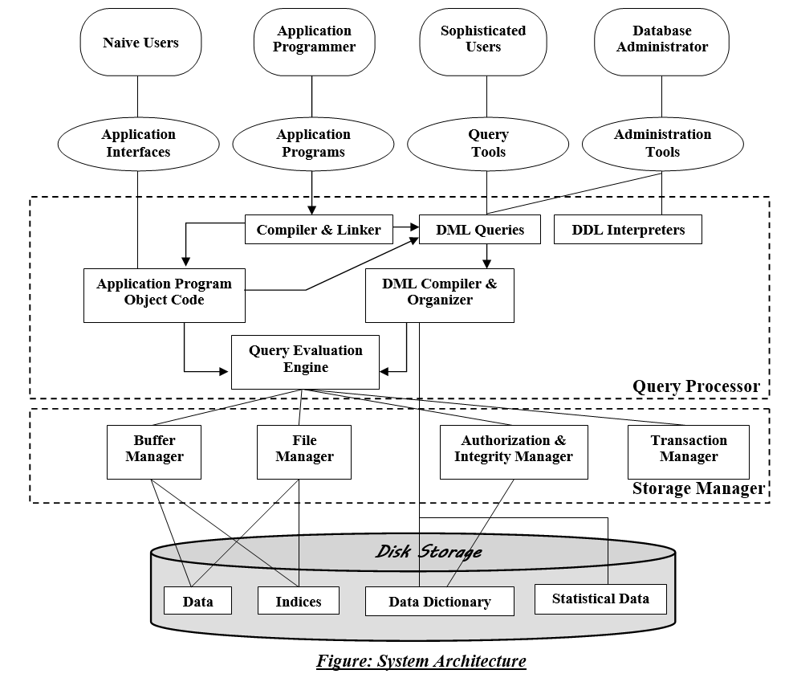

# 1장 DBMS 아키텍쳐
### - 공짜 밥은 존재할까?

##### 1강 DBMS 아키텍쳐 개요

RDB(Relational Database)는 여러 제품이 있으며, 각각의 특징과 장단점이 있다. 따라서 내부 아키텍처들이 조금씩 다르다. 하지만 RDB로써의 기능을 제공한다는 목적은 모두 동일하다.
모두 관계 모델ㄹ이라는 수학적 이론을 바탕으로 하여 기본적인 구조 자체는 모두 같다.
상기 기름은 DBMS의 일반적인 아키텍처의 개요이다.

~~위 그림은 인터넷에서 퍼온 글이므로 책에 나오는 그림과는 다소 차이가 있다.~~

### DBMS 내부의 기능
#### 1.쿼리 평가 엔진
- 사용자로부터 입력받은 SQL 구문을 분석하고, 기억장치에 접근하는 순서(실행계획)을 결정한다. 쿼리 평가 엔진은 **계획**을 세우고 **실행**하는 핵심기능을 담당하는 모듈이다.

#### 2. 버퍼 매니저
- DBMS는 버퍼라는 메모리 영역을 확보하는데, 이 메모리 영역을 관리하는것이 버퍼 매니저이다. 버퍼 매니저는 디스크 용량 매니저와 함께 연동되어 작동한다.

#### 3. 디스크 용량 매니저
- 데이터의 저장을 관리하며, 데이터의 IO를 제어한다.

#### 4. 트랜잭션 매니저와 락 매니저
- 트랜젝션의 정합성(consistency)을 유지하면서 실행하고, 락 매니저는 데이터에 락을 걸어 다른 요청을 대기시킨다.

#### 5. 리커버리 매니저
- 시스템은 언제나 장애가 발생할 수 있기에, 데이터를 정기적으로 백업하고, 문제가 일어났을 때 복구를 해줘야 하는데, 이 기능을 수행하는 것이 리커버리 매지너이다.

---
성능상의 관점에서 가장 중요한 것은 **쿼리 평가 엔진**이다.

# 2장 DBMS와 버퍼
- 버퍼는 성능에 굉장히 중요한 영향을 미친다.

#### 1. 공짜 밥은 존재할까?
- 일반적으로 기억장치는 **기억비용**에 따라 1차부터 3차까지의 계층으로 분류한다. ~~(상기 그림에서는 PROCESSOR계층과 RAM 계층을 1차로 보면 된다.)~~
상위 계층일수록 빠르고, 비싸고, 작다. 하위 계층은 느리고, 싸고, 크다. 따라서 많은 데이터를 영속적으로 저장하려 하면 속도를 잃고, 속도를 얻으려하면 많은 데이터를 영속적으로 저장하기 힘들다는 트레이드오프가 발생한다.

#### 2. DBMS와 기억장치의 관계
- DMBS는 데이터 저장을 목적으로 하는 미들웨어이다. DBMS가 사용하는 대표적인 기억장치는 다음 2가지이다.
  - 하드디스크
    - 용량, 비용, 성능의 관점에서 대부분 하드디스크를 선택
    - 기억장치 계층에서 2차 기억장치로 분류
  - 메모리
    - 디스크에 비해 높은 비용
  - 버퍼를 활용한 속도 향상
    - DBMS는 성능향상을 위해 일부라도 데이터를 메모리 위에 올린다.
    - SQL 구문의 실행 시간 대부분을 I/O에 사용하기에 디스크의 접근을 줄일 수 있다면 성능 향상을 대폭 이끌어 낼 수 있음.

#### 3. 메모리 위에 있는 두 개의 버퍼
- 데이터 캐시
- 로그 버퍼
  - 갱신 처리(INSERT, DELETE, UPDATE, MERGE)와 같은 구문을 받으면, 로그 버퍼 위에 변경 정보를 보내고 이후 디스크에 변경을 수행한다.(COMMIT)

##### 성능을 높이기 위하여 시점을 차이를 두는 것이다.
##### DBMS는 저장소의 느림을 어떻게 보완할 것인가를 고민해온 미들웨어이다.

#### 4. 메모리의 성질이 초래하는 트레이드 오프
- 휘발성
  - 메모리는 데이터 영속성이 없고, 전원을 끄면 데이터가 휘발됨.
- 발성의 문제점
  - 데이터의 부정합이 발생.
  - 로그 버퍼 위에 존재하는 데이터가 휘발되어 사라지는 현상을 막기위해 Commit을 사용한다. 
  
#### 5. 시스템 특성에 따른 트레이드오프
- 데이터 캐시와 로그 버퍼의 크기
  - 물리 메모리에 여유가 있다면 데이터 캐시를 되도록 많이 할당할 것을 추천한다.
  - SELECT보다 갱신이 많다면 로그버퍼의 크기를 늘려주는 튜닝이 필요하다.
- 검색과 갱신 중에서 중요한 것
  - 갱신처리가 많으면 로그버퍼를 크게, 검색이 많다면 데이터 캐시를 크게 튜닝하는게 좋다. ~~(때에 따라 다르게 튜닝한다.)~~

#### 6. 추가적인 메모리 영역 '워킹 메모리'
- 3.에서의 버퍼 이외에도 

---

